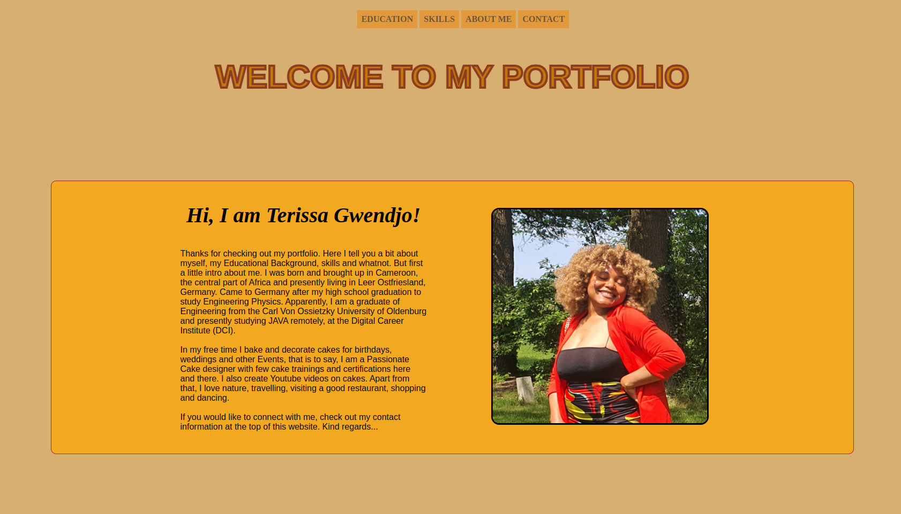

# portfolio
<h1 align="center">Hi 👋, here is my Portfolio</h1>
<h4 align="left">This Project is all about my Portolio. I created a Website where I tell you a bit about myself, my Educational Background, skills and whatnot. To be able to create this Website, I used tools like html and css</h4>

 
  I started by linking my style.css file to my index.html file by including it in the head as well as the fontawesome link for my icons. Secondly, I created a header with an unordered list with all intended parameters such as Educational background, skills and contact information. The header's position was set to sticky, center and z-index 99

